基于springboot酒店宾馆管理系统

项目代码已收录公众号【java项目源码】，需要请自行关注一下公众号并下载源码

主要分三种角色：管理者/工作人员/前台人员。

主要功能有：
客房：客房标准、房间信息；
订单：入住订单；
员工：员工信息；
事务：事务信息；
停车：车位信息；
财务：财务信息；
历史：订单历史、车库历史；
会员：会员信息；

1. 后端：SpringBoot

2. 前端：html+layui+jQuery

CSDN博客地址：[基于springboot酒店宾馆管理系统](https://blog.csdn.net/mataodehtml/article/details/121617661)

B站演示视频地址：[基于springboot酒店宾馆管理系统](https://www.bilibili.com/video/BV16L41177Wd)

管理员：

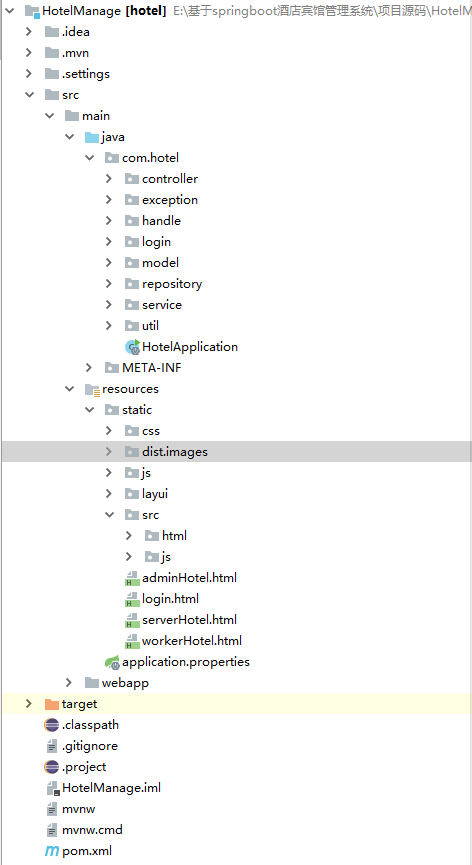

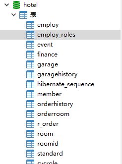

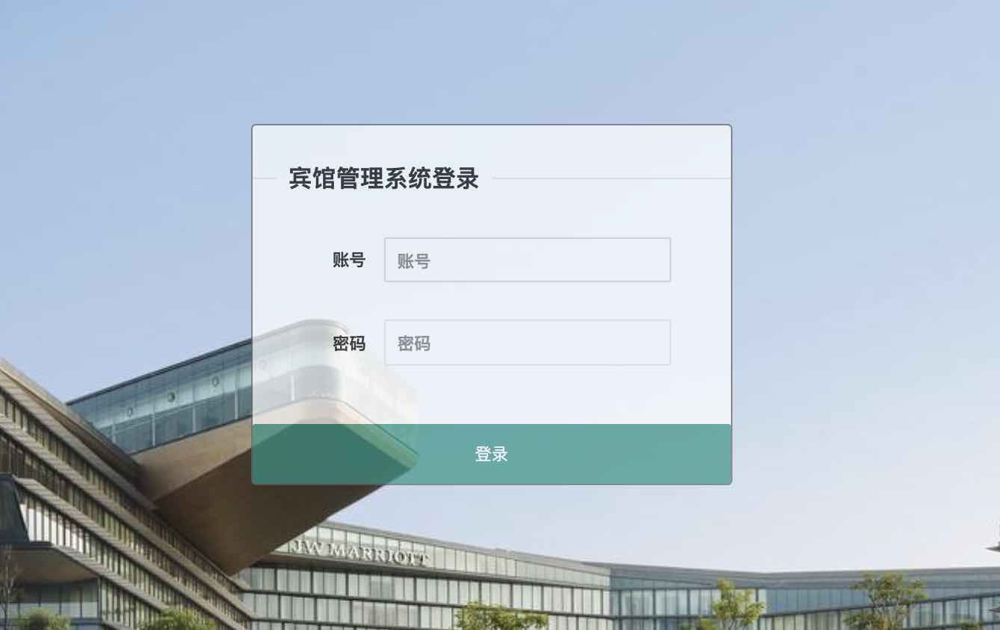

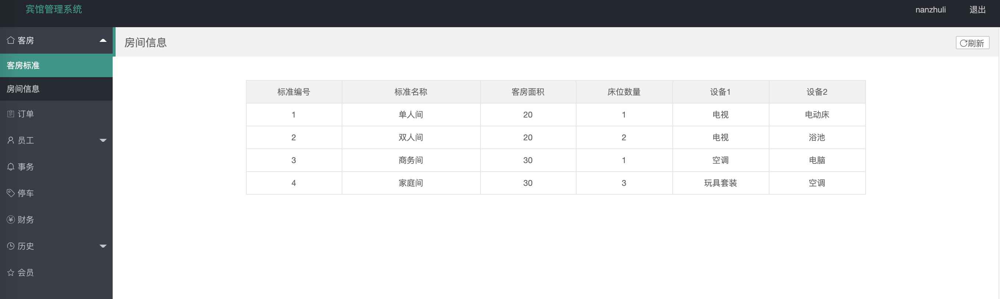

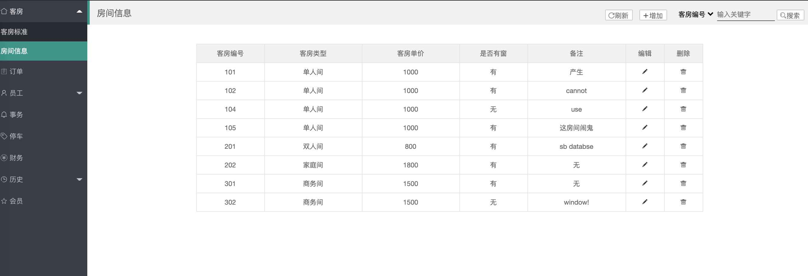

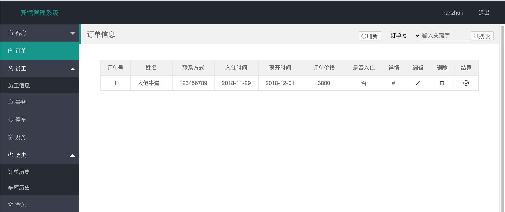

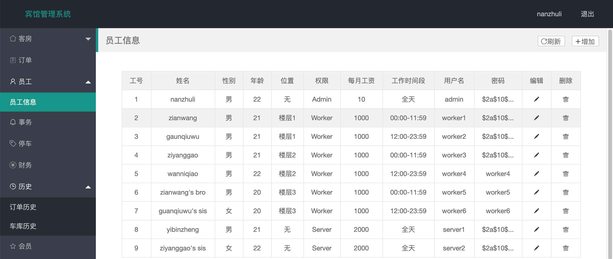

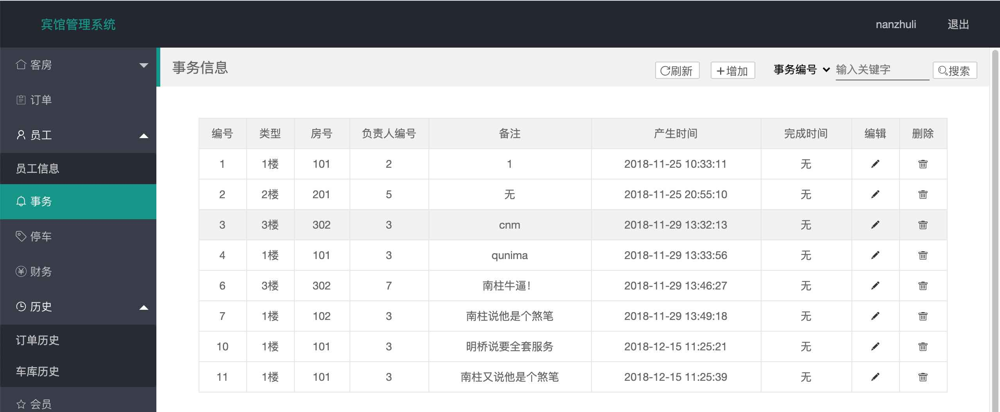

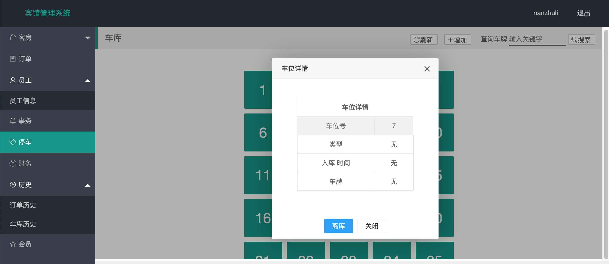

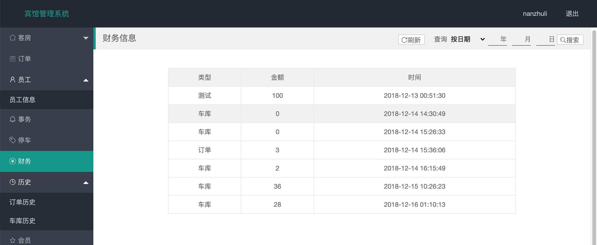

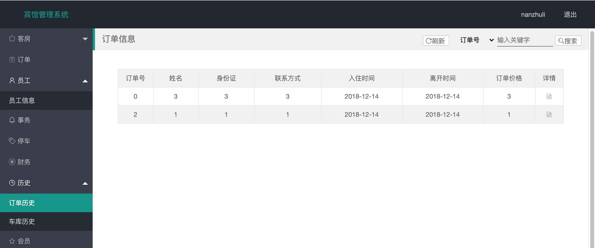

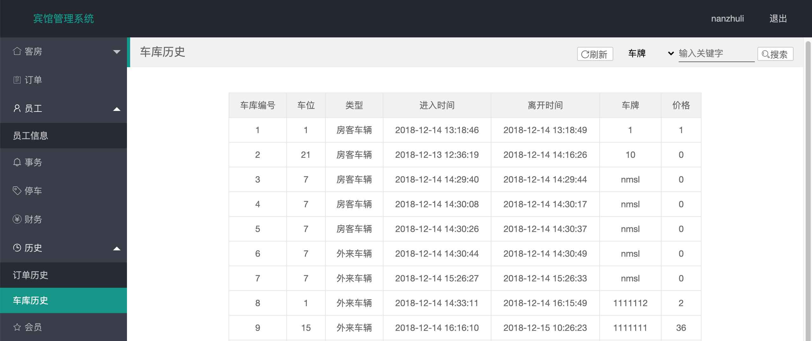

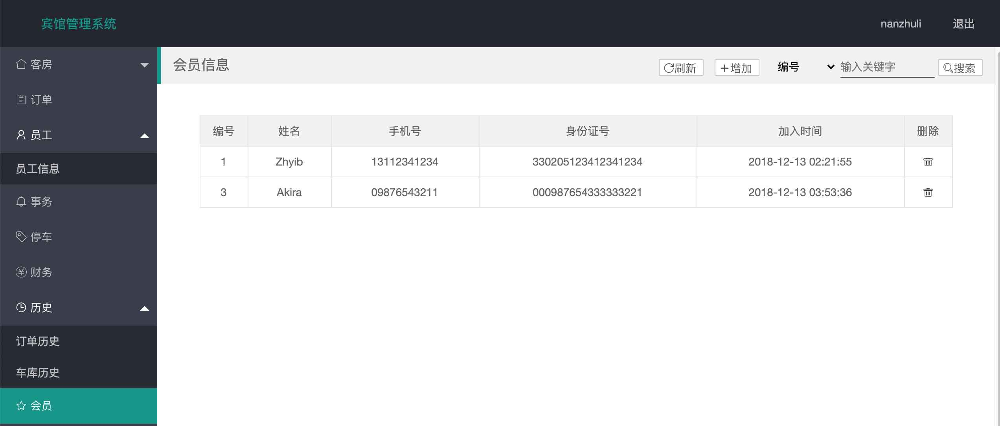

